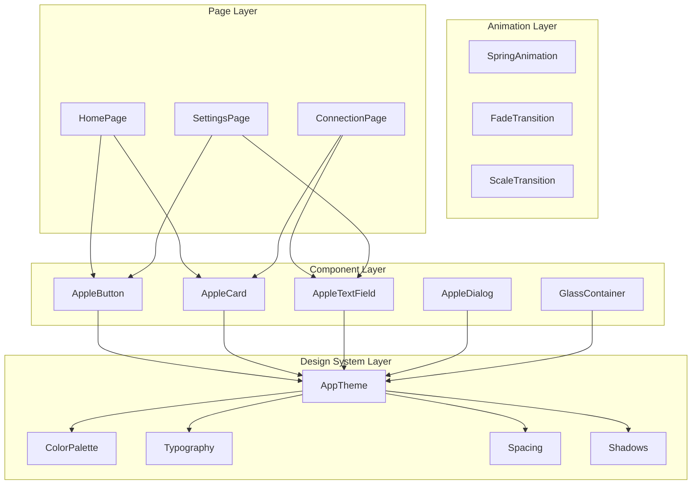

# Design Document: Apple UI Redesign

## Overview

PixPOS Remote uygulamasını Apple 2026 design language'ına uygun şekilde yeniden tasarlıyoruz. Bu tasarım, Flutter'ın mevcut widget sistemini kullanarak modern, profesyonel ve satışa hazır bir UI oluşturmayı hedefliyor.

## Architecture



## Components and Interfaces

### 1. Design System Core (lib/design_system/)

```dart
// lib/design_system/apple_theme.dart
class AppleTheme {
  // Colors
  static const Color primaryBlue = Color(0xFF007AFF);
  static const Color systemGreen = Color(0xFF34C759);
  static const Color systemYellow = Color(0xFFFFCC00);
  static const Color systemRed = Color(0xFFFF3B30);
  static const Color systemOrange = Color(0xFFFF9500);
  
  // Light Mode
  static const Color lightBackground = Color(0xFFF2F2F7);
  static const Color lightSurface = Color(0xFFFFFFFF);
  static const Color lightSecondary = Color(0xFFE5E5EA);
  static const Color lightTertiary = Color(0xFFC7C7CC);
  static const Color lightText = Color(0xFF000000);
  static const Color lightSecondaryText = Color(0xFF8E8E93);
  
  // Dark Mode
  static const Color darkBackground = Color(0xFF000000);
  static const Color darkSurface = Color(0xFF1C1C1E);
  static const Color darkSecondary = Color(0xFF2C2C2E);
  static const Color darkTertiary = Color(0xFF38383A);
  static const Color darkText = Color(0xFFFFFFFF);
  static const Color darkSecondaryText = Color(0xFF8E8E93);
  
  // Spacing
  static const double spacing4 = 4.0;
  static const double spacing8 = 8.0;
  static const double spacing12 = 12.0;
  static const double spacing16 = 16.0;
  static const double spacing20 = 20.0;
  static const double spacing24 = 24.0;
  static const double spacing32 = 32.0;
  static const double spacing40 = 40.0;
  static const double spacing48 = 48.0;
  
  // Border Radius
  static const double radiusSmall = 8.0;
  static const double radiusMedium = 12.0;
  static const double radiusLarge = 16.0;
  static const double radiusXLarge = 20.0;
  static const double radiusRound = 100.0;
  
  // Shadows
  static List<BoxShadow> get lightShadow => [
    BoxShadow(
      color: Colors.black.withOpacity(0.04),
      blurRadius: 8,
      offset: Offset(0, 2),
    ),
    BoxShadow(
      color: Colors.black.withOpacity(0.08),
      blurRadius: 24,
      offset: Offset(0, 8),
    ),
  ];
  
  static List<BoxShadow> get darkShadow => [
    BoxShadow(
      color: Colors.black.withOpacity(0.3),
      blurRadius: 16,
      offset: Offset(0, 4),
    ),
  ];
}
```

### 2. Typography System

```dart
// lib/design_system/apple_typography.dart
class AppleTypography {
  static const String fontFamily = 'Inter'; // or 'SF Pro Display'
  
  // Large Title - 34px Bold
  static TextStyle largeTitle(BuildContext context) => TextStyle(
    fontFamily: fontFamily,
    fontSize: 34,
    fontWeight: FontWeight.w700,
    letterSpacing: -0.4,
    color: Theme.of(context).textTheme.bodyLarge?.color,
  );
  
  // Title 1 - 28px Bold
  static TextStyle title1(BuildContext context) => TextStyle(
    fontFamily: fontFamily,
    fontSize: 28,
    fontWeight: FontWeight.w700,
    letterSpacing: -0.4,
    color: Theme.of(context).textTheme.bodyLarge?.color,
  );
  
  // Title 2 - 22px Bold
  static TextStyle title2(BuildContext context) => TextStyle(
    fontFamily: fontFamily,
    fontSize: 22,
    fontWeight: FontWeight.w700,
    letterSpacing: -0.4,
    color: Theme.of(context).textTheme.bodyLarge?.color,
  );
  
  // Title 3 - 20px Semibold
  static TextStyle title3(BuildContext context) => TextStyle(
    fontFamily: fontFamily,
    fontSize: 20,
    fontWeight: FontWeight.w600,
    color: Theme.of(context).textTheme.bodyLarge?.color,
  );
  
  // Headline - 17px Semibold
  static TextStyle headline(BuildContext context) => TextStyle(
    fontFamily: fontFamily,
    fontSize: 17,
    fontWeight: FontWeight.w600,
    color: Theme.of(context).textTheme.bodyLarge?.color,
  );
  
  // Body - 17px Regular
  static TextStyle body(BuildContext context) => TextStyle(
    fontFamily: fontFamily,
    fontSize: 17,
    fontWeight: FontWeight.w400,
    height: 1.5,
    color: Theme.of(context).textTheme.bodyLarge?.color,
  );
  
  // Callout - 16px Regular
  static TextStyle callout(BuildContext context) => TextStyle(
    fontFamily: fontFamily,
    fontSize: 16,
    fontWeight: FontWeight.w400,
    color: Theme.of(context).textTheme.bodyLarge?.color,
  );
  
  // Subheadline - 15px Regular
  static TextStyle subheadline(BuildContext context) => TextStyle(
    fontFamily: fontFamily,
    fontSize: 15,
    fontWeight: FontWeight.w400,
    color: Theme.of(context).textTheme.bodyMedium?.color,
  );
  
  // Footnote - 13px Regular
  static TextStyle footnote(BuildContext context) => TextStyle(
    fontFamily: fontFamily,
    fontSize: 13,
    fontWeight: FontWeight.w400,
    color: Theme.of(context).textTheme.bodySmall?.color,
  );
  
  // Caption 1 - 12px Regular
  static TextStyle caption1(BuildContext context) => TextStyle(
    fontFamily: fontFamily,
    fontSize: 12,
    fontWeight: FontWeight.w400,
    color: Theme.of(context).textTheme.bodySmall?.color,
  );
  
  // Caption 2 - 11px Regular
  static TextStyle caption2(BuildContext context) => TextStyle(
    fontFamily: fontFamily,
    fontSize: 11,
    fontWeight: FontWeight.w400,
    color: Theme.of(context).textTheme.bodySmall?.color,
  );
  
  // Monospace for IDs
  static TextStyle monospace(BuildContext context) => TextStyle(
    fontFamily: 'JetBrains Mono',
    fontSize: 28,
    fontWeight: FontWeight.w500,
    letterSpacing: 2,
    color: Theme.of(context).textTheme.bodyLarge?.color,
  );
}
```

### 3. Glass Container Component

```dart
// lib/design_system/components/glass_container.dart
class GlassContainer extends StatelessWidget {
  final Widget child;
  final double blur;
  final double opacity;
  final BorderRadius? borderRadius;
  final EdgeInsets? padding;
  
  const GlassContainer({
    Key? key,
    required this.child,
    this.blur = 20.0,
    this.opacity = 0.7,
    this.borderRadius,
    this.padding,
  }) : super(key: key);
  
  @override
  Widget build(BuildContext context) {
    final isDark = Theme.of(context).brightness == Brightness.dark;
    
    return ClipRRect(
      borderRadius: borderRadius ?? BorderRadius.circular(AppleTheme.radiusMedium),
      child: BackdropFilter(
        filter: ImageFilter.blur(sigmaX: blur, sigmaY: blur),
        child: Container(
          padding: padding ?? EdgeInsets.all(AppleTheme.spacing16),
          decoration: BoxDecoration(
            color: isDark 
              ? Colors.white.withOpacity(0.1)
              : Colors.white.withOpacity(opacity),
            borderRadius: borderRadius ?? BorderRadius.circular(AppleTheme.radiusMedium),
            border: Border.all(
              color: isDark 
                ? Colors.white.withOpacity(0.1)
                : Colors.white.withOpacity(0.3),
              width: 1,
            ),
          ),
          child: child,
        ),
      ),
    );
  }
}
```

### 4. Apple Button Component

```dart
// lib/design_system/components/apple_button.dart
enum AppleButtonStyle { filled, outlined, text }
enum AppleButtonSize { small, medium, large }

class AppleButton extends StatefulWidget {
  final String text;
  final VoidCallback? onPressed;
  final AppleButtonStyle style;
  final AppleButtonSize size;
  final IconData? icon;
  final bool isLoading;
  
  const AppleButton({
    Key? key,
    required this.text,
    this.onPressed,
    this.style = AppleButtonStyle.filled,
    this.size = AppleButtonSize.medium,
    this.icon,
    this.isLoading = false,
  }) : super(key: key);
  
  @override
  State<AppleButton> createState() => _AppleButtonState();
}

class _AppleButtonState extends State<AppleButton> 
    with SingleTickerProviderStateMixin {
  late AnimationController _controller;
  late Animation<double> _scaleAnimation;
  bool _isPressed = false;
  
  @override
  void initState() {
    super.initState();
    _controller = AnimationController(
      duration: Duration(milliseconds: 100),
      vsync: this,
    );
    _scaleAnimation = Tween<double>(begin: 1.0, end: 0.97).animate(
      CurvedAnimation(parent: _controller, curve: Curves.easeInOut),
    );
  }
  
  double get _height {
    switch (widget.size) {
      case AppleButtonSize.small: return 32;
      case AppleButtonSize.medium: return 44;
      case AppleButtonSize.large: return 52;
    }
  }
  
  double get _fontSize {
    switch (widget.size) {
      case AppleButtonSize.small: return 14;
      case AppleButtonSize.medium: return 16;
      case AppleButtonSize.large: return 18;
    }
  }
  
  @override
  Widget build(BuildContext context) {
    final isDark = Theme.of(context).brightness == Brightness.dark;
    
    Color backgroundColor;
    Color textColor;
    Border? border;
    
    switch (widget.style) {
      case AppleButtonStyle.filled:
        backgroundColor = AppleTheme.primaryBlue;
        textColor = Colors.white;
        break;
      case AppleButtonStyle.outlined:
        backgroundColor = Colors.transparent;
        textColor = AppleTheme.primaryBlue;
        border = Border.all(color: AppleTheme.primaryBlue, width: 1.5);
        break;
      case AppleButtonStyle.text:
        backgroundColor = Colors.transparent;
        textColor = AppleTheme.primaryBlue;
        break;
    }
    
    return GestureDetector(
      onTapDown: (_) {
        setState(() => _isPressed = true);
        _controller.forward();
      },
      onTapUp: (_) {
        setState(() => _isPressed = false);
        _controller.reverse();
        widget.onPressed?.call();
      },
      onTapCancel: () {
        setState(() => _isPressed = false);
        _controller.reverse();
      },
      child: AnimatedBuilder(
        animation: _scaleAnimation,
        builder: (context, child) => Transform.scale(
          scale: _scaleAnimation.value,
          child: AnimatedContainer(
            duration: Duration(milliseconds: 150),
            height: _height,
            padding: EdgeInsets.symmetric(horizontal: AppleTheme.spacing20),
            decoration: BoxDecoration(
              color: _isPressed 
                ? backgroundColor.withOpacity(0.8) 
                : backgroundColor,
              borderRadius: BorderRadius.circular(AppleTheme.radiusMedium),
              border: border,
            ),
            child: Row(
              mainAxisSize: MainAxisSize.min,
              mainAxisAlignment: MainAxisAlignment.center,
              children: [
                if (widget.isLoading)
                  SizedBox(
                    width: 20,
                    height: 20,
                    child: CircularProgressIndicator(
                      strokeWidth: 2,
                      valueColor: AlwaysStoppedAnimation(textColor),
                    ),
                  )
                else ...[
                  if (widget.icon != null) ...[
                    Icon(widget.icon, color: textColor, size: _fontSize + 2),
                    SizedBox(width: AppleTheme.spacing8),
                  ],
                  Text(
                    widget.text,
                    style: TextStyle(
                      fontSize: _fontSize,
                      fontWeight: FontWeight.w600,
                      color: textColor,
                    ),
                  ),
                ],
              ],
            ),
          ),
        ),
      ),
    );
  }
  
  @override
  void dispose() {
    _controller.dispose();
    super.dispose();
  }
}
```

### 5. Apple Card Component

```dart
// lib/design_system/components/apple_card.dart
class AppleCard extends StatefulWidget {
  final Widget child;
  final VoidCallback? onTap;
  final EdgeInsets? padding;
  final bool elevated;
  
  const AppleCard({
    Key? key,
    required this.child,
    this.onTap,
    this.padding,
    this.elevated = true,
  }) : super(key: key);
  
  @override
  State<AppleCard> createState() => _AppleCardState();
}

class _AppleCardState extends State<AppleCard> {
  bool _isHovered = false;
  
  @override
  Widget build(BuildContext context) {
    final isDark = Theme.of(context).brightness == Brightness.dark;
    
    return MouseRegion(
      onEnter: (_) => setState(() => _isHovered = true),
      onExit: (_) => setState(() => _isHovered = false),
      child: GestureDetector(
        onTap: widget.onTap,
        child: AnimatedContainer(
          duration: Duration(milliseconds: 200),
          curve: Curves.easeOut,
          padding: widget.padding ?? EdgeInsets.all(AppleTheme.spacing16),
          decoration: BoxDecoration(
            color: isDark 
              ? (_isHovered ? AppleTheme.darkSecondary : AppleTheme.darkSurface)
              : (_isHovered ? AppleTheme.lightBackground : AppleTheme.lightSurface),
            borderRadius: BorderRadius.circular(AppleTheme.radiusMedium),
            boxShadow: widget.elevated 
              ? (isDark ? AppleTheme.darkShadow : AppleTheme.lightShadow)
              : null,
            border: isDark ? Border.all(
              color: AppleTheme.darkTertiary,
              width: 0.5,
            ) : null,
          ),
          transform: _isHovered && widget.onTap != null
            ? (Matrix4.identity()..translate(0.0, -2.0))
            : Matrix4.identity(),
          child: widget.child,
        ),
      ),
    );
  }
}
```

### 6. Apple Text Field Component

```dart
// lib/design_system/components/apple_text_field.dart
class AppleTextField extends StatefulWidget {
  final String? label;
  final String? hint;
  final TextEditingController? controller;
  final bool obscureText;
  final TextInputType? keyboardType;
  final String? Function(String?)? validator;
  final IconData? prefixIcon;
  final IconData? suffixIcon;
  final VoidCallback? onSuffixTap;
  
  const AppleTextField({
    Key? key,
    this.label,
    this.hint,
    this.controller,
    this.obscureText = false,
    this.keyboardType,
    this.validator,
    this.prefixIcon,
    this.suffixIcon,
    this.onSuffixTap,
  }) : super(key: key);
  
  @override
  State<AppleTextField> createState() => _AppleTextFieldState();
}

class _AppleTextFieldState extends State<AppleTextField> {
  bool _isFocused = false;
  final FocusNode _focusNode = FocusNode();
  
  @override
  void initState() {
    super.initState();
    _focusNode.addListener(() {
      setState(() => _isFocused = _focusNode.hasFocus);
    });
  }
  
  @override
  Widget build(BuildContext context) {
    final isDark = Theme.of(context).brightness == Brightness.dark;
    
    return Column(
      crossAxisAlignment: CrossAxisAlignment.start,
      children: [
        if (widget.label != null) ...[
          Text(
            widget.label!,
            style: AppleTypography.footnote(context).copyWith(
              color: isDark ? AppleTheme.darkSecondaryText : AppleTheme.lightSecondaryText,
            ),
          ),
          SizedBox(height: AppleTheme.spacing8),
        ],
        AnimatedContainer(
          duration: Duration(milliseconds: 200),
          decoration: BoxDecoration(
            color: isDark ? AppleTheme.darkSecondary : AppleTheme.lightBackground,
            borderRadius: BorderRadius.circular(AppleTheme.radiusMedium),
            border: Border.all(
              color: _isFocused 
                ? AppleTheme.primaryBlue 
                : (isDark ? AppleTheme.darkTertiary : AppleTheme.lightSecondary),
              width: _isFocused ? 2 : 1,
            ),
          ),
          child: TextField(
            controller: widget.controller,
            focusNode: _focusNode,
            obscureText: widget.obscureText,
            keyboardType: widget.keyboardType,
            style: AppleTypography.body(context),
            decoration: InputDecoration(
              hintText: widget.hint,
              hintStyle: AppleTypography.body(context).copyWith(
                color: isDark ? AppleTheme.darkSecondaryText : AppleTheme.lightSecondaryText,
              ),
              contentPadding: EdgeInsets.symmetric(
                horizontal: AppleTheme.spacing16,
                vertical: AppleTheme.spacing12,
              ),
              border: InputBorder.none,
              prefixIcon: widget.prefixIcon != null 
                ? Icon(widget.prefixIcon, color: AppleTheme.lightSecondaryText)
                : null,
              suffixIcon: widget.suffixIcon != null
                ? IconButton(
                    icon: Icon(widget.suffixIcon, color: AppleTheme.lightSecondaryText),
                    onPressed: widget.onSuffixTap,
                  )
                : null,
            ),
          ),
        ),
      ],
    );
  }
  
  @override
  void dispose() {
    _focusNode.dispose();
    super.dispose();
  }
}
```

### 7. Status Indicator Component

```dart
// lib/design_system/components/status_indicator.dart
enum ConnectionStatus { connected, connecting, disconnected, error }

class StatusIndicator extends StatefulWidget {
  final ConnectionStatus status;
  final double size;
  final bool showPulse;
  
  const StatusIndicator({
    Key? key,
    required this.status,
    this.size = 8,
    this.showPulse = true,
  }) : super(key: key);
  
  @override
  State<StatusIndicator> createState() => _StatusIndicatorState();
}

class _StatusIndicatorState extends State<StatusIndicator>
    with SingleTickerProviderStateMixin {
  late AnimationController _controller;
  late Animation<double> _pulseAnimation;
  
  @override
  void initState() {
    super.initState();
    _controller = AnimationController(
      duration: Duration(milliseconds: 1500),
      vsync: this,
    )..repeat(reverse: true);
    
    _pulseAnimation = Tween<double>(begin: 1.0, end: 1.5).animate(
      CurvedAnimation(parent: _controller, curve: Curves.easeInOut),
    );
  }
  
  Color get _color {
    switch (widget.status) {
      case ConnectionStatus.connected: return AppleTheme.systemGreen;
      case ConnectionStatus.connecting: return AppleTheme.systemYellow;
      case ConnectionStatus.disconnected: return AppleTheme.lightSecondaryText;
      case ConnectionStatus.error: return AppleTheme.systemRed;
    }
  }
  
  bool get _shouldPulse {
    return widget.showPulse && 
           (widget.status == ConnectionStatus.connecting ||
            widget.status == ConnectionStatus.connected);
  }
  
  @override
  Widget build(BuildContext context) {
    return AnimatedBuilder(
      animation: _pulseAnimation,
      builder: (context, child) {
        return Container(
          width: widget.size * (_shouldPulse ? _pulseAnimation.value : 1),
          height: widget.size * (_shouldPulse ? _pulseAnimation.value : 1),
          decoration: BoxDecoration(
            color: _color,
            shape: BoxShape.circle,
            boxShadow: _shouldPulse ? [
              BoxShadow(
                color: _color.withOpacity(0.4),
                blurRadius: 8,
                spreadRadius: 2,
              ),
            ] : null,
          ),
        );
      },
    );
  }
  
  @override
  void dispose() {
    _controller.dispose();
    super.dispose();
  }
}
```

## Data Models

### Theme Configuration Model

```dart
class AppleThemeConfig {
  final bool isDarkMode;
  final Color accentColor;
  final double cornerRadius;
  final bool useGlassmorphism;
  final bool enableAnimations;
  
  const AppleThemeConfig({
    this.isDarkMode = false,
    this.accentColor = AppleTheme.primaryBlue,
    this.cornerRadius = 12.0,
    this.useGlassmorphism = true,
    this.enableAnimations = true,
  });
}
```


## Correctness Properties

*A property is a characteristic or behavior that should hold true across all valid executions of a system-essentially, a formal statement about what the system should do. Properties serve as the bridge between human-readable specifications and machine-verifiable correctness guarantees.*

### Property 1: Theme Consistency
*For any* UI component rendered in the application, the colors, typography, and spacing SHALL conform to the AppleTheme design system values.
**Validates: Requirements 1.1, 1.4, 3.1, 4.1**

### Property 2: Dark Mode Color Mapping
*For any* color used in light mode, there SHALL exist a corresponding dark mode color that maintains the same semantic meaning and contrast ratio.
**Validates: Requirements 1.2, 1.3**

### Property 3: Touch Target Size
*For any* interactive element (button, link, icon button), the touch target size SHALL be at least 44x44 pixels.
**Validates: Requirements 4.5, 5.5**

### Property 4: Animation Duration Bounds
*For any* UI animation, the duration SHALL be between 100ms and 500ms to ensure responsiveness without being jarring.
**Validates: Requirements 5.3, 7.3, 15.4**

### Property 5: Border Radius Consistency
*For any* container element (card, button, input, dialog), the border radius SHALL use one of the predefined values (8, 12, 16, 20px).
**Validates: Requirements 4.3, 4.4, 5.1, 6.1**

### Property 6: Spacing Grid Alignment
*For any* spacing value used in the UI, it SHALL be a multiple of 4px (preferably 8px base unit).
**Validates: Requirements 4.1, 4.2**

### Property 7: Glass Effect Blur Range
*For any* glassmorphism container, the blur radius SHALL be between 10px and 30px with opacity between 0.6 and 0.9.
**Validates: Requirements 2.1, 2.2, 2.3**

### Property 8: Status Color Semantics
*For any* status indicator, green SHALL indicate success/connected, yellow SHALL indicate warning/connecting, and red SHALL indicate error/disconnected.
**Validates: Requirements 10.1, 10.4**

## Error Handling

### Theme Loading Errors
- IF theme configuration fails to load, THE system SHALL fall back to default light theme
- IF custom font fails to load, THE system SHALL use system default sans-serif font

### Animation Errors
- IF animation controller fails, THE system SHALL skip animation and show final state immediately
- IF glassmorphism is not supported, THE system SHALL fall back to solid color backgrounds

### Component Rendering Errors
- IF a component fails to render, THE system SHALL display a placeholder with error boundary
- IF image assets fail to load, THE system SHALL display a colored placeholder

## Testing Strategy

### Unit Tests
- Test color contrast ratios meet WCAG AA standards
- Test spacing calculations produce correct values
- Test animation curves produce expected values at key points
- Test theme switching preserves user preferences

### Property-Based Tests
- **Property 1**: Generate random UI components and verify theme compliance
- **Property 3**: Generate random interactive elements and verify touch target sizes
- **Property 5**: Generate random containers and verify border radius values
- **Property 6**: Generate random layouts and verify spacing grid alignment

### Integration Tests
- Test theme switching across all pages
- Test animation performance on low-end devices
- Test glassmorphism rendering on different platforms
- Test responsive layout at different screen sizes

### Visual Regression Tests
- Capture screenshots of all major screens in light/dark mode
- Compare against baseline images for pixel-perfect accuracy
- Test on multiple device sizes (phone, tablet, desktop)
